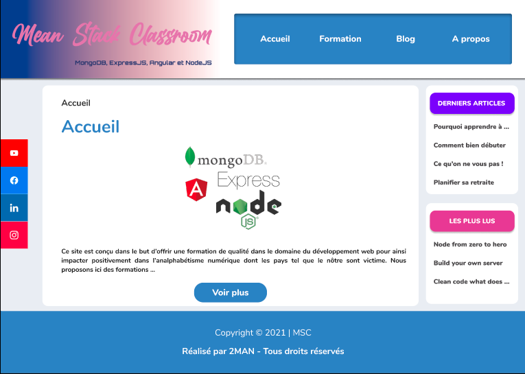

# Mean Stack Classroom
Ce projet consiste en la réalisation d'un site de formation sur les technologies MongoDB, Express, Angular et NodeJSHTML et CSS à l'issu de la formation MEAN Stack du PSEJ. Le but de ce projet est de montrer notre aptitude à pouvoir manipuler les languages du web **HTML** & **CSS** from Scratch.

## Etapes de la réalisation

### 1) Réalisation de la maquette d'accueil
 

